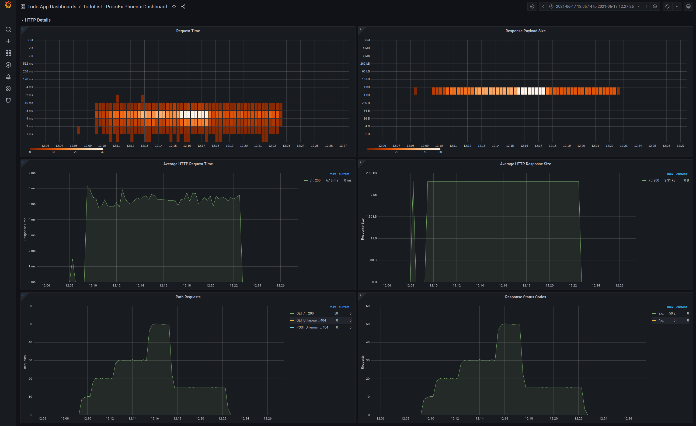
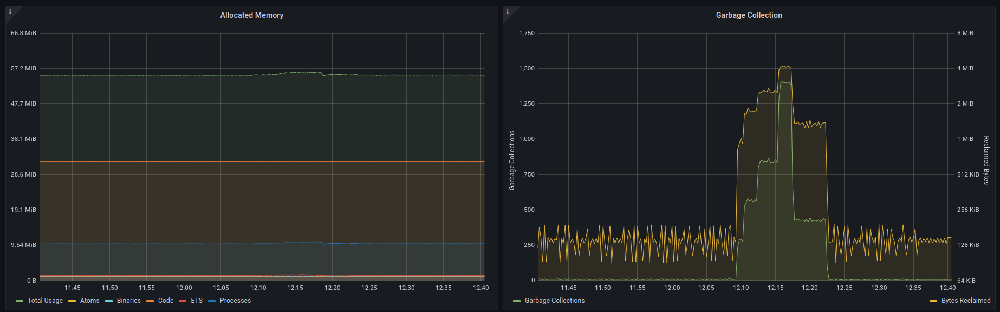
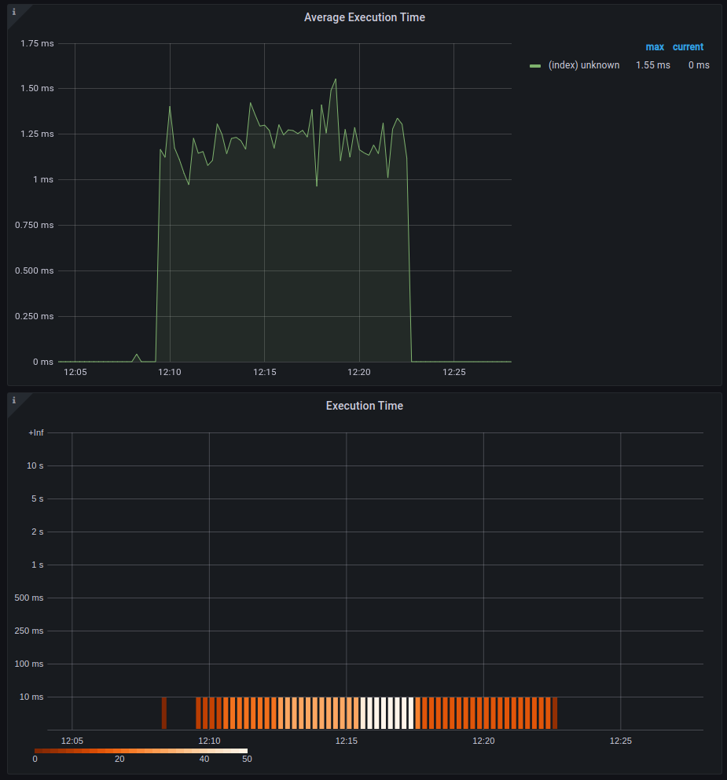

# Monitoring Your Fly.io Apps With Prometheus

The Fly platform offers a managed, easy-to-use Prometheus solution for all of your application metrics. Once your
application metrics are stored in Prometheus, surfacing those metrics is a breeze using Grafana (which you can also run
on Fly.io). Let's explore some of the concepts surrounding Prometheus and see how we can leverage the Fly.io monitoring
tools in an Elixir application to get slick looking dashboards like this one:



## Why Application Monitoring is Important

When customers are paying for your application or service, they expect it to work every time they reach for it. If
things are broken, or errors are occurring, your customers will not be happy. If you are lucky, your customers will send
you an email letting you know that things are not working as expected. Unfortunately, many of these occurrences will go
unreported and your credibility as a service provider will diminish.

Knowing exactly when things are going wrong is key to running a successful business and keeping your customers happy.
This is the problem that monitoring tools solve. They keep an eye on your application, and let you know exactly when
things are behaving suboptimally. Imagine for example that you have an HTTP JSON API and a new version of the
application is deployed that makes some changes to a number of endpoints. It is not feasible to go through every
single route of your application every time you deploy and test each endpoint individually with every permutation of
input data. That would take far too much time and would not scale from an organizational perspective since engineers
would have to be context switching between feature work, and testing new deployments.

A more scalable solution would be to briefly smoke test the application after a deployment (as a sanity check), and then
trust that the monitoring tooling will pick up on and report on any errors. If your monitoring solution reports that
your HTTP JSON API is now responding with 400 or 500 errors, you know you have a problem and you can either rollback
the application, or stop it from propagating to across the cluster. The key point being that you can proactively address
issues as opposed to being blind to them or sinking precious engineer time into testing all the things.

While ensuring that production users are not experiencing issues is a huge benefit of application monitoring, there are
some other benefits that should also be mentioned. Those being:

- Quantifying stress testing results
- Business priority planning based on real usage data
- System performance and capacity planning

Let's dig into how Prometheus achieves these goals at the technical level.

## How Does Prometheus Work?

At its core, Prometheus is a time-series database that enables you to persist metrics in an efficient and performant
manor. Once your metrics are in the Prometheus time-series database, you can create alerting rules using Alertmanager or
Grafana. Those alerts can then be triggered once certain thresholds and criteria are met, letting you know that
something has gone wrong. "But how exactly do my application metrics end up in Prometheus?" you may be wondering. Your
Prometheus instance is configured to scrape all of your configured applications and each of their instances at a regular
interval and storing that data in the database. Specifically, it makes a GET HTTP call to `/metrics` (or wherever your
metrics are exposed) and that endpoint will contain a snap shot in time of the state of your application.

Once your metrics are in Prometheus, you can query the time-series database with Grafana to plot the data over time.
Your Grafana panels will make PromQL queries to refresh the time-series data and your visualizations can be updated.
Given that Prometheus scrapes your applications at a regular interval (every 10 seconds is usually a good place to
start), the resolution of your time-series data is bound to that interval. In other words, if you get 1,000 requests in
the span of 10 seconds, you don't know exactly at what timestamps those 1,000 requests came in, you just know that you
got 1,000 requests in a 10 second time window. While this may seem limiting, it is actually a benefit in disguise. Since
Prometheus doesn't need to keep track of every single timestamp, it is able to store all the time-series data very
efficiently. In fact, a single Prometheus instance is usually sufficient to monitor an entire cluster of compute nodes
and applications.

Luckily with Fly.io, the administration and management of Prometheus can be taken care of for you!

## How does Fly.io Make This Easier?

Managing, configuring and administering your own Prometheus instance can be a bit of a tall order if you have never
worked with Prometheus before. Fortunately, all you need to do to enable Prometheus metrics for your application is add
a couple of lines to your `fly.toml` manifest file. Specifically, all Fly needs to know is what port and path your
metrics will be available at. For the [TODO List Elixir application](LINK_TO_GITHUB) for example, the following
configuration was all that was needed:

```toml
[metrics]
port = 4000
path = "/metrics"
```

In order to visualize your Prometheus metrics, you'll need to have an instance of Grafana running somewhere. You can
deploy your own Grafana instance on Fly.io by [following this guide](https://github.com/fly-apps/grafana), or you can
run a managed solution. Which ever route you take, all you then need to do is configure Grafana to [communicate with the
Fly.io managed Prometheus instance](https://fly.io/docs/reference/metrics/#grafana) and you are good to go!

Let's see how we structure an Elixir application for easy monitoring with Prometheus.

## Elixir Application Monitoring

Whenever I write a production-grade Elixir application that needs monitoring, I reach for the
[PromEx](https://github.com/akoutmos/prom_ex) library that I maintain. The reason I reach for PromEx (and the reason I
wrote it), is because it manages both the collection of metrics and the lifecycle of the complimentary Grafana
dashboards. At a library design level, PromEx is a plugin style library, where you enable a plugin for whatever library
you want to monitor. For example, PromEx has plugins to capture metrics for Phoenix, Ecto, the Erlang VM itself,
Phoenix LiveView and several more. Each of these plugins also has a dashboard to present all the captured metrics for
you. In addition, PromEx can communicate with Grafana using the Grafana HTTP API, so it will upload the dashboards
automatically for you on application start (if you configure it that is). What this means is that you can go from zero
to complete application metrics and dashboards in less that 10 minutes!

In the [Elixir example application](LINK_TO_GITHUB), you can see that the PromEx module definition specifies what
plugins PromEx should initialize, and what dashboards should be uploaded to Grafana:

```elixir
defmodule TodoList.PromEx do
  use PromEx, otp_app: :todo_list

  alias PromEx.Plugins

  @impl true
  def plugins do
    [
      # PromEx built in plugins
      Plugins.Application,
      Plugins.Beam,
      {Plugins.Phoenix, router: TodoListWeb.Router},
      Plugins.PhoenixLiveView
    ]
  end

  @impl true
  def dashboard_assigns do
    [
      datasource_id: "prometheus"
    ]
  end

  @impl true
  def dashboards do
    [
      # PromEx built in Grafana dashboards
      {:prom_ex, "application.json"},
      {:prom_ex, "beam.json"},
      {:prom_ex, "phoenix.json"},
      {:prom_ex, "phoenix_live_view.json"}
    ]
  end
end
```

With a little bit of configuration in `runtime.exs` PromEx can communicate with Grafana to take care of the graph
annotations and dashboard uploads:

```elixir
config :todo_list, TodoList.PromEx,
  manual_metrics_start_delay: :no_delay,
  grafana: [
    host: System.get_env("GRAFANA_HOST") || raise("GRAFANA_HOST is required"),
    auth_token: System.get_env("GRAFANA_TOKEN") || raise("GRAFANA_TOKEN is required"),
    upload_dashboards_on_start: true,
    folder_name: "Todo App Dashboards",
    annotate_app_lifecycle: true
  ]
```

With the managed Prometheus instance from Fly, and the metrics collection from PromEx, you have an instrumented
application in record time! Here are some snapshots from the auto generated dashboards for the [Todo List
application](LINK_TO_GITHUB):




## Closing Thoughts

All in all between the managed Prometheus offering and the ability to self host Grafana on Fly, and the easy to use
PromEx library, you can have your application instrumented with dashboards and annotations. Be sure to check out the
[Todo List application Repo](LINK_TO_GITHUB) for more technical details and all the code necessary to do this yourself.
What used to take a few days to set up and run, now only takes a few hours, so be sure to give it a test drive!
