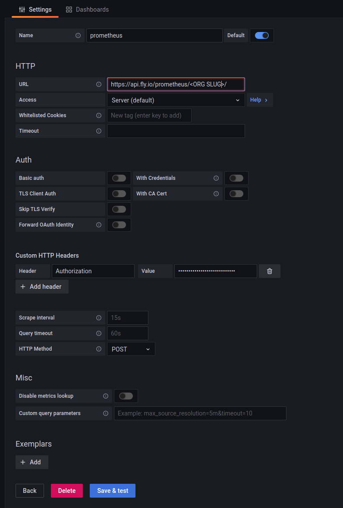

# Running Grafana On Fly.io

## Deploying a Grafana Instance

Deploying Grafana to Fly.io is actually very easy. All you need to do is copy
the `grafana/fly.toml` file in this repo, replace the `<YOUR APP NAME GOES HERE>` and
`<YOUR GRAFANA ADMIN PASSWORD GOES HERE>` placeholders. If there are other
configuration values that you would like to change make those as well.

After the `fly.toml` file has been updated to fit your needs, run the following commands
to deploy Grafana (make sure that your current working directory contains the
`fly.toml` file that you just edited):

```shell
$ flyctl apps create todo-list-grafana --no-config
...

$ flyctl volumes create grafana_storage --region ord # Or pick the region closest to you
...

$ flyctl deploy
...
1 desired, 1 placed, 1 healthy, 0 unhealthy [health checks: 1 total, 1 passing]
--> v0 deployed successfully
```

After the deployment finishes, you should be able to run `flyctl open` and a
browser window will open up with your Grafana instance. The username will be
`admin` and the password will be whatever you provided in place of the
`<YOUR GRAFANA ADMIN PASSWORD GOES HERE>` placeholder.

Once you are logged into Grafana you'll need to do a little bit of configuration so that
the you can hook up PromEx with Grafana. Let's do that next.

## Configuring Grafana For PromEx Integration

Once you open up the Grafana service, navigate to `https://<YOU GRAFANA INSTANCE URL>/org/apikeys`
and click the `Add API key` button. Then enter a `Key name` (I usually set it to `PromEx`) and set
the `Role` to `Editor`. Then press the `Add` button and be sure to copy the API key that was generated.
The API key will only be displayed once, so you'll need to go through this flow again if you lose it.

Now that the Grafana side of things is set up, deploy the Todo List application (see the `todo_list/README.md`
file for instructions).

## Connecting To Prometheus

After the Todo List application has been deployed, you'll notice that all of the Grafana
dashboards listed in the `TodoList.PromEx` module have been uploaded. You'll also probably notice that
none of them work! The reason is your Grafana instance has not been configured to
communicate with your alloced Prometheus instance. Let's fix that :).

Go to `https://<YOU GRAFANA INSTANCE URL>/datasources` and click the `Add data source` button. From there,
select Prometheus as your desired data source and configure it as shown below:



Be sure to use the auth token that you generated while deploying the Todo List
application for the `Authorization` header value. Also be sure to prefix the
`Authorization` value with `Bearer <YOUR TOKEN HERE>`. Make sure to name the
datasource `prometheus` (with a lower-case `p`) given that is what PromEx has
set as a `datasource_id`.

Finally, press the `Save & test` button and you are all set! With that in
place, if you go back to your dashboards they will all magically work given
that Grafana can successfully query your Prometheus instance. Congratulations!
